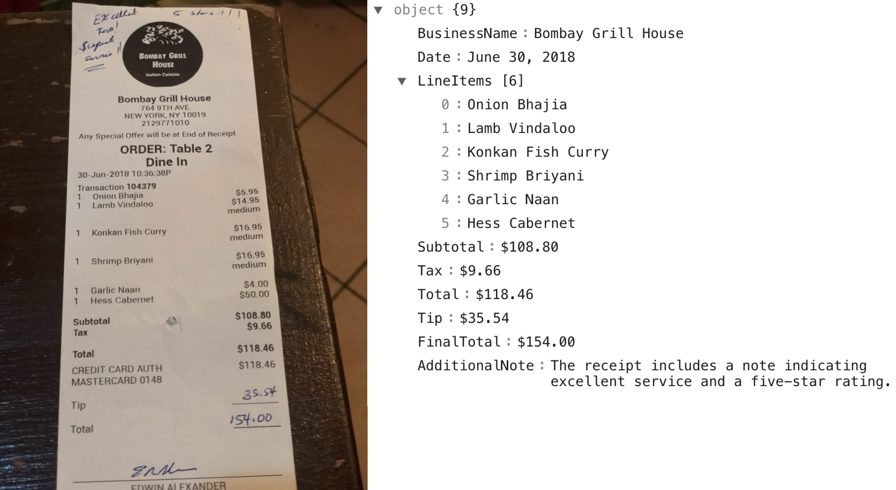

# Run the samples


Setup the environment

```shell
python3 -m venv .venv
source .venv/bin/activate
```


Set your OpenAI API key

```shell
export OPENAI_API_KEY=<your-api-key>
```

Install requirements

```shell
pip install -r requirements.txt
```

```shell
python main.py ./example/1000-receipt.jpg
```
